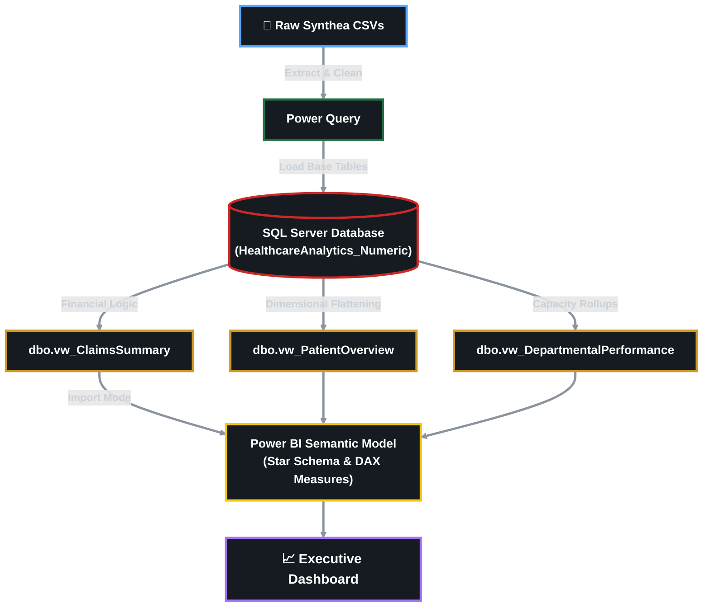

# 🏥 Healthcare Operations Data Analytics

[](https://www.python.org/)
[](https://www.microsoft.com/sql-server)
[](https://learn.microsoft.com/power-query/)
[](https://powerbi.microsoft.com/)
[](https://learn.microsoft.com/dax/)

> **Transforming 900,000+ synthetic patient records into an executive dashboard that tracks clinical capacity and revenue cycle KPIs — built on a SQL Server presentation layer and a Power BI semantic model.**

**[▶ Live Dashboard](#)** &nbsp;&nbsp; **[📊 Sample Screenshots](#dashboard-preview)**

---

## 📌 Business Problem

Healthcare leaders sit on enormous volumes of clinical and financial data, but rarely have a single, governed source of truth to answer basic operational questions in real time. This project simulates the analytics function of a hospital system, built around the questions executives actually ask:

- Are patient admissions increasing or declining?
- What is the current readmission rate?
- How is mortality trending?
- Which departments generate the highest claim volume?
- Where are unpaid balances accumulating?
- How does utilization vary across patient demographics?
- What operational factors are associated with longer length of stay?

The solution bridges raw clinical data and executive decision-making by combining a **SQL Server presentation layer** with a **Power BI semantic model and KPI framework** — mirroring how analytics teams operate in real healthcare organizations.

---

## 🎯 Project Objective

Build a scalable analytics solution that defines and tracks **North Star metrics and core operational KPIs** across the full value chain:

**Patient Utilization → Clinical Operations → Revenue Cycle → Financial Performance**

---

## 🏗 Architecture



## 🗃 Data Source

This project uses **[Synthea](https://synthea.mitre.org/)**, an open-source synthetic patient generator developed by MITRE. All 900,000+ records are **artificially generated** — there is no real patient data (PHI) involved, which makes the dataset safe to publish and analyze publicly while still modeling realistic clinical and claims patterns (admissions, encounters, conditions, procedures, claims).

---

## 🧪 Methodology

1. **Extraction** — Raw Synthea CSVs (patients, encounters, conditions, procedures, claims) ingested via Power Query.
2. **Cleaning & Standardization** — Data typing, null handling, and date normalization performed in Python.
3. **Loading** — Cleaned tables loaded into SQL Server (`HealthcareAnalytics_Numeric`).
4. **Business Logic Layer** — T-SQL views built to encapsulate reusable logic: claims financials, patient-level rollups, and departmental capacity metrics.
5. **Modeling** — Star schema built in Power BI with fact/dimension separation; DAX measures written for KPIs.

---

## 📊 Key KPIs Tracked

| Category | Metrics |
|---|---|
| Patient Utilization | Admissions volume, admissions trend, demographic mix |
| Clinical Operations | Readmission rate, mortality rate, average length of stay |
| Revenue Cycle | Claim volume by department, unpaid balance / AR aging |
| Financial Performance | Revenue by payer, revenue by department |

---

## 💡 Key Findings

- **[Finding 1]** — e.g., "Readmission rates were X% higher in [department], driven primarily by [factor]."
- **[Finding 2]** — e.g., "Unpaid balances were concentrated in [payer/department], representing $X in outstanding AR."
- **[Finding 3]** — e.g., "Average length of stay increased X% among [demographic], correlating with [operational factor]."
- **[Recommendation]** — What would you tell a hospital COO to do based on this?

---

## 🖼 Dashboard Preview

```


```

```

```

